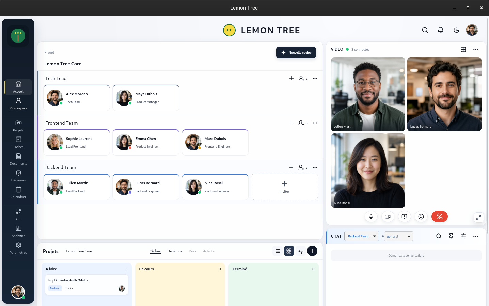
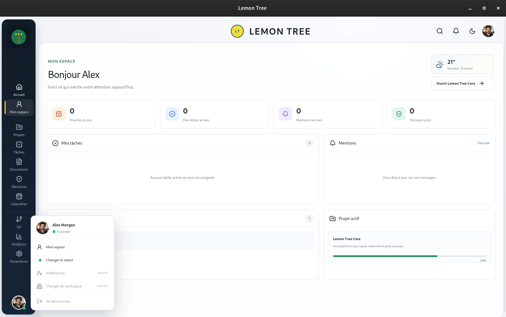

# Lemon Tree

Lemon Tree est un espace de travail desktop pour organiser un projet, faire avancer les tâches et garder les échanges d'équipe au même endroit.

<p align="center">
  
  
</p>

## Fonctionnalités

- Espaces d'équipe personnalisables avec choix de couleur et statut de présence.
- Tableau Kanban pour créer, modifier, déplacer et supprimer les tâches.
- Canaux de discussion, mentions, pièces jointes et indicateur de saisie.
- Notifications et suivi des mentions non lues.
- Décisions sauvegardées depuis les conversations.
- Vue personnelle regroupant les tâches, équipes, mentions et projet actif.
- Interface de travail redimensionnable et persistance locale avec SQLite.

## Technologies

- [Tauri 2](https://tauri.app/) et Rust pour l'application desktop.
- React, TypeScript et Vite pour l'interface.
- SQLite pour la persistance locale.
- Vitest et Testing Library pour les tests.

## Prérequis

- Node.js 20 ou plus récent.
- Rust, avec les prérequis de développement de Tauri installés pour votre système.

## Installation

```bash
git clone https://github.com/evdk25-wq/Lemon-tree.git
cd Lemon-tree
npm install
```

## Lancer l'application

```bash
npm run desktop -- dev
```

## Commandes

| Commande                 | Description                                   |
| ------------------------ | --------------------------------------------- |
| `npm run desktop -- dev` | Lance l'application Tauri en développement.   |
| `npm run build`          | Génère le build de production de l'interface. |
| `npm run format`         | Formate les fichiers avec Prettier.           |
| `npm run format:check`   | Vérifie le formatage.                         |
| `npm run lint`           | Exécute ESLint.                               |
| `npm run typecheck`      | Vérifie les types TypeScript.                 |
| `npm test`               | Lance les tests.                              |

## Architecture

Le projet suit une Clean Architecture en quatre couches :

- `domain` contient les entités et les règles métier.
- `application` regroupe les cas d'usage et les ports.
- `infrastructure` implémente la persistance et les services techniques.
- `presentation` contient l'interface React.

Les détails sont disponibles dans la [documentation d'architecture](docs/architecture/overview.md) et les [décisions techniques](docs/decisions/).

## Plateformes prises en charge

- Windows
- macOS
- Linux

## Licence

Lemon Tree est un logiciel propriétaire. Tous droits réservés.
